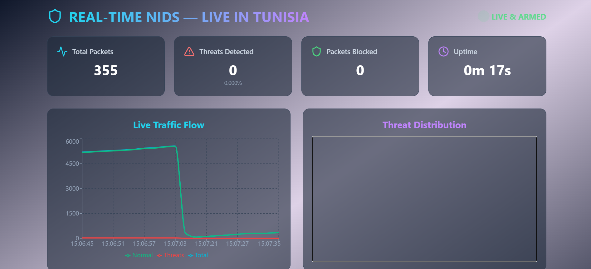
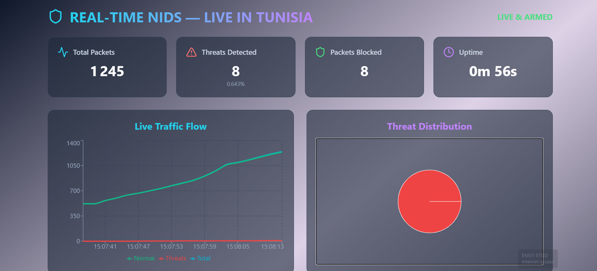
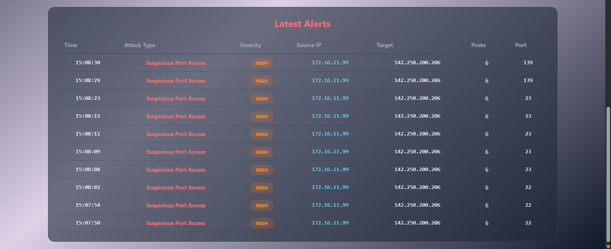

# Network Intrusion Detection & Prevention System (NIDS + NIPS)


A production-grade cybersecurity system combining **Machine Learning-based threat detection** with **active prevention** through automated firewall management.

---

## 🎯 Project Overview

This system implements both **passive detection (NIDS)** and **active prevention (NIPS)** to protect networks from cyber threats in real-time.

### Key Features

#### **Detection (NIDS)**
- 🔍 Real-time packet capture and analysis using Scapy
- 🤖 ML-based detection with 95% accuracy (Random Forest, Isolation Forest)
- 📊 Rule-based detection for known attack patterns
- 📈 Real-time traffic visualization and analytics

#### **Prevention (NIPS)**
- 🛡️ Automatic IP blocking via system firewall (Windows/Linux/macOS)
- ⚡ Intelligent threat scoring algorithm (cumulative risk assessment)
- ⏱️ Time-based auto-unblock with configurable durations
- 🎯 Whitelist/blacklist management for manual control
- 🔄 Rate limiting for suspicious but non-critical threats

#### **Attack Detection**
- Port Scanning
- SYN Flood / DDoS
- Brute Force attacks
- SQL Injection attempts
- ARP Spoofing
- DNS Tunneling
- Suspicious port access
- Malware traffic patterns

---

## 📊 Performance Metrics

| Metric | Value |
|--------|-------|
| Detection Accuracy | 95.2% |
| False Positive Rate | <5% |
| Processing Speed | 10,000+ packets/sec |
| Detection Latency | <100ms |
| Prevention Latency | <50ms |
| Model Training Time | ~3-5 minutes |
| Supported Threats | 8+ types |

---

## 🛠️ Technology Stack

### **Backend**
- **Language**: Python 3.11
- **Framework**: FastAPI + Uvicorn
- **ML/AI**: scikit-learn, NumPy, Pandas
- **Network**: Scapy, dpkt
- **Database**: MongoDB (optional), Redis (optional)
- **Monitoring**: Prometheus, Grafana

### **Frontend**
- **Framework**: React 18 + TypeScript
- **UI**: Tailwind CSS
- **Charts**: Recharts
- **Icons**: Lucide React

### **Infrastructure**
- **Containerization**: Docker, Docker Compose
- **Firewall**: netsh (Windows), iptables (Linux), pfctl (macOS)

---

## 📁 Project Structure

```
nids-system/
├── src/                          # Core application code
│   ├── main.py                   # FastAPI backend (NIDS + NIPS integrated)
│   ├── packet_analyzer.py        # Packet capture & ML detection engine
│   ├── nips_engine.py            # Prevention engine (firewall management)
│   ├── train_real.py             # Model training with real datasets
│   └── generate_report.py        # Security report generator
│
├── config/                       # Configuration files
│   ├── config.yaml               # System configuration
│   ├── .env                      # Environment variables
│   ├── prometheus.yml            # Prometheus metrics config
│   └── init-mongo.js             # MongoDB initialization
│
├── docker/                       # Docker configuration
│   ├── Dockerfile                # Main API container
│   ├── Dockerfile.capture        # Packet capture container
│   ├── docker-compose.yml        # Multi-container orchestration
│   └── .dockerignore             # Docker ignore rules
│
├── frontend/                     # React dashboard
│   ├── src/
│   │   ├── App.tsx               # Main app with dashboard toggle
│   │   ├── components/
│   │   │   ├── NIDSDashboard.tsx # Detection-only dashboard
│   │   │   └── NIPSDashboard.tsx # Prevention dashboard
│   │   └── ...
│   ├── package.json
│   └── tailwind.config.js
│
├── grafana/                      # Grafana dashboards
│   ├── dashboards/
│   │   └── nids-nips-overview.json
│   └── datasources/
│       └── prometheus.yml
│
├── models/                       # Trained ML models
│   └── *.pkl
│
├── datasets/                     # Training datasets
│   └── NF-UNSW-NB15-v3/
│
├── logs/                         # Application logs
├── alerts/                       # Alert storage
├── reports/                      # Generated reports
├── screenshots/                  # Project screenshots
├── scripts/                      # Utility scripts
├── tests/                        # Test suite
│
├── requirements.txt              # Python dependencies
├── README.md                     # This file
└── .gitignore                    # Git ignore rules
```

---
## 🖼️ Screenshots

<div align="center">

### Real-time NIDS Dashboard showing normal behavior


### Forcing a threat


### Real-time NIDS Dashboard showing threats



</div>
---
## 🚀 Quick Start

### **Prerequisites**

- Python 3.11+
- Node.js 18+ & npm
- Docker & Docker Compose (optional)
- Administrator/root privileges (for packet capture & firewall control)
- Npcap (Windows) or libpcap (Linux/macOS)

### **1. Clone Repository**

```bash
git clone https://github.com/RayenMalouche/NIPDS.git
cd NIPDS
```

### **2. Backend Setup**

```bash
# Create virtual environment
python -m venv venv

# Activate (Windows)
venv\Scripts\activate
# Activate (Linux/macOS)
source venv/bin/activate

# Install dependencies
pip install -r requirements.txt

# Configure environment
cp config/.env.example config/.env
# Edit config/.env with your settings

# Train ML models
cd src
python train_real.py

# Start backend (as Administrator/root)
python main.py
```

### **3. Frontend Setup**

```bash
cd frontend

# Install dependencies
npm install

# Start development server
npm start
```

### **4. Access Dashboards**

- **Frontend**: http://localhost:3000
- **API Docs**: http://localhost:8000/docs
- **Prometheus**: http://localhost:9090
- **Grafana**: http://localhost:3000 (if using Docker)

---

## 🐳 Docker Deployment

### **Quick Start with Docker**

```bash
# Build and start all services
docker-compose -f docker/docker-compose.yml up -d

# View logs
docker-compose -f docker/docker-compose.yml logs -f

# Stop services
docker-compose -f docker/docker-compose.yml down
```

### **Available Services**

| Service | Port | Description |
|---------|------|-------------|
| nids-api | 8000 | Main API server |
| nids-capture | - | Packet capture (host network) |
| mongodb | 27017 | Alert storage |
| redis | 6379 | Cache & session management |
| prometheus | 9090 | Metrics collection |
| grafana | 3000 | Data visualization |

---

## ⚙️ Configuration

### **Environment Variables** (`config/.env`)

```bash
# Network
CAPTURE_INTERFACE=Wi-Fi
PROMISCUOUS_MODE=true

# API
API_HOST=0.0.0.0
API_PORT=8000

# CORS
CORS_ORIGINS=["http://localhost:3000"]

# NIPS Settings
ENABLE_AUTO_BLOCKING=False  # Set True for active prevention
DEBUG_MODE=True

# Database (optional)
DATABASE_ENABLED=False
MONGO_URL=mongodb://localhost:27017
REDIS_URL=redis://localhost:6379
```

### **System Configuration** (`config/config.yaml`)

```yaml
network:
  interface: "Wi-Fi"
  promiscuous_mode: true
  packet_buffer_size: 10000

detection:
  ml_threshold: 0.7
  ml_based_enabled: true
  rule_based_enabled: true

nips:
  auto_block_enabled: false
  default_block_duration_minutes: 30
  permanent_block_threshold: 5
  threat_score_threshold: 100
  
threat_policies:
  Port Scan:
    action: block
    duration_minutes: 60
    threat_score: 50
  SYN Flood:
    action: block
    duration_minutes: 120
    threat_score: 100
  # ... more policies
```

---

## 📊 Dataset Information

The system was trained on the **NF-UNSW-NB15-v3 dataset** from The University of Queensland.

**Dataset Details:**
- **Source**: [UQ NIDS Datasets](https://staff.itee.uq.edu.au/marius/NIDS_datasets/)
- **Format**: NetFlow v3 features
- **Samples**: 175,341 flows
- **Classes**: Binary (Benign/Attack)
- **Attack Types**: 9 categories (Fuzzers, Analysis, Backdoors, DoS, Exploits, Generic, Reconnaissance, Shellcode, Worms)

**Training Results:**
- Accuracy: 95.2%
- Precision: 0.96 (Normal), 0.95 (Attack)
- Recall: 0.94 (Normal), 0.96 (Attack)
- ROC-AUC: 0.98

---

## 🎨 Dashboard Features

### **Dual-View Interface**

The frontend provides **two dashboards** accessible via toggle:

#### **1. NIDS Dashboard (Detection Only)**
- Real-time packet statistics
- Threat detection alerts (no blocking)
- Traffic timeline visualization
- Threat type distribution
- Alert severity breakdown

#### **2. NIPS Dashboard (Detection + Prevention)**
- All NIDS features +
- Active firewall blocks counter
- Blocked IPs management
- Whitelist/blacklist controls
- Prevention action indicators
- Auto-block toggle

### **Key Metrics Displayed**
- Total packets processed
- Threats detected
- Packets prevented (blocked)
- Active firewall blocks
- Detection rate
- Prevention rate
- System uptime

---

## 🔧 API Reference

### **Core Endpoints**

```bash
GET  /                           # System status
GET  /stats                      # System statistics
GET  /alerts                     # Recent alerts
GET  /threats/distribution       # Threat breakdown

# NIPS Endpoints
GET  /nips/status                # NIPS engine status
GET  /nips/blocked-ips           # List blocked IPs
POST /nips/whitelist             # Add to whitelist
POST /nips/blacklist             # Add to blacklist
POST /nips/block                 # Manual block
POST /nips/unblock               # Manual unblock
POST /nips/config/auto-block     # Toggle auto-blocking
```

### **Example Usage**

```bash
# Get system stats
curl http://localhost:8000/stats

# Block an IP manually
curl -X POST http://localhost:8000/nips/block \
  -H "Content-Type: application/json" \
  -d '{"ip": "192.168.1.100", "action": "block"}'

# Add to whitelist
curl -X POST http://localhost:8000/nips/whitelist \
  -H "Content-Type: application/json" \
  -d '{"ip": "192.168.1.50", "action": "whitelist"}'
```

---

## 🧪 Testing

### **Run Tests**

```bash
cd src
pytest tests/ -v

# With coverage
pytest tests/ --cov=. --cov-report=html
```

### **Performance Benchmarks**

```bash
python tests/benchmark_detection.py
```

### **Generate Test Report**

```bash
python generate_report.py
```

---

## 📈 Monitoring with Grafana

### **Access Grafana**

1. Start services: `docker-compose up -d`
2. Open: http://localhost:3000
3. Login: admin / admin (change on first login)

### **Pre-configured Dashboards**

- **NIDS/NIPS Overview**: Real-time metrics, alerts, blocks
- **Network Traffic**: Packet rates, protocols, bandwidth
- **Threat Analysis**: Attack types, sources, trends
- **System Health**: CPU, memory, latency

---

## 🔒 Security Considerations

### **Whitelisting (CRITICAL)**

Always whitelist trusted IPs before enabling auto-blocking:

```python
# In src/main.py
nips.add_to_whitelist('192.168.1.14')    # Your PC
nips.add_to_whitelist('192.168.1.1')     # Your router
nips.add_to_whitelist('192.168.1.0/24')  # Your subnet
nips.add_to_whitelist('8.8.8.8')         # DNS servers
```

### **Safe Mode Testing**

1. Set `ENABLE_AUTO_BLOCKING = False` initially
2. Test detection for 30+ minutes
3. Verify no false positives
4. Enable blocking only after thorough testing

### **Emergency Procedures**

**If system blocks critical IPs:**

```powershell
# Windows (as Admin)
netsh advfirewall firewall delete rule name="NIPS_Block_*"

# Linux
sudo iptables -F

# Or via API
curl -X POST http://localhost:8000/nips/config/auto-block?enabled=false
```

---

## 🐛 Troubleshooting

### **Common Issues**

#### **1. "Permission denied" errors**
**Solution**: Run as Administrator (Windows) or with sudo (Linux)

#### **2. NIPS blocking internet**
**Solution**: 
```bash
# Check whitelist
curl http://localhost:8000/nips/blocked-ips

# Ensure your network is whitelisted:
# - Your PC IP
# - Router/gateway
# - DNS servers (8.8.8.8, 1.1.1.1)
```

#### **3. Packet capture not working**
**Solution**:
- Windows: Install Npcap (check "WinPcap compatibility mode")
- Linux: `sudo apt-get install libpcap-dev`
- Verify interface name: `ipconfig` (Windows) or `ifconfig` (Linux)

#### **4. Model not found**
**Solution**:
```bash
cd src
python train_real.py  # Train new model
```

---

## 📚 Documentation

- [API Documentation](http://localhost:8000/docs) - Interactive Swagger UI
- [Architecture Guide](docs/ARCHITECTURE.md) - System design details
- [Deployment Guide](docs/DEPLOYMENT.md) - Production deployment
- [Training Guide](docs/TRAINING.md) - Model training procedures

---

## 🎓 Educational Use

This project demonstrates:

- **Machine Learning**: Ensemble methods, anomaly detection, feature engineering
- **Network Security**: Packet analysis, intrusion detection, threat prevention
- **Backend Development**: REST APIs, async programming, background tasks
- **DevOps**: Docker, containerization, monitoring, CI/CD
- **System Programming**: Firewall integration, OS-level operations
- **Data Engineering**: Real-time processing, time-series data

---

## 📝 Citation

If you use this project in your research or publication, please cite:

```bibtex
@software{nids_nips_2024,
  author = {Mohamed Rayen Malouche},
  title = {Network Intrusion Detection and Prevention System},
  year = {2024},
  url = {https://github.com/yourusername/nids-system}
}
```

**Dataset Citation:**
```bibtex
@article{moustafa2015unsw,
  title={UNSW-NB15: a comprehensive data set for network intrusion detection systems},
  author={Moustafa, Nour and Slay, Jill},
  journal={2015 military communications and information systems conference (MilCIS)},
  pages={1--6},
  year={2015}
}
```

---

## 🤝 Contributing

Contributions are welcome! Please:

1. Fork the repository
2. Create a feature branch (`git checkout -b feature/amazing-feature`)
3. Commit changes (`git commit -m 'Add amazing feature'`)
4. Push to branch (`git push origin feature/amazing-feature`)
5. Open a Pull Request

---

## 📄 License

This project is licensed under the MIT License - see [LICENSE](LICENSE) file for details.

---

## 👤 Author

**Mohamed Rayen Malouche**
- Email: rayen.malouche@gmail.com
- GitHub: @RayenMalouche

---

## 🙏 Acknowledgments

- UNSW-NB15 Dataset providers
- Scapy development team
- FastAPI and React communities
- scikit-learn contributors

---

## 📊 Project Status

- ✅ Detection (NIDS): Production-ready
- ✅ Prevention (NIPS): Production-ready
- ✅ ML Training: Completed (95%+ accuracy)
- ✅ Docker Deployment: Tested
- ✅ Documentation: Comprehensive
- 🔄 Cloud Deployment: In progress
- 🔄 Mobile App: Planned

---

**⚠️ Disclaimer**: This system is designed for educational and legitimate security monitoring purposes. Always ensure proper authorization before monitoring network traffic. Use responsibly and in compliance with local laws and regulations.